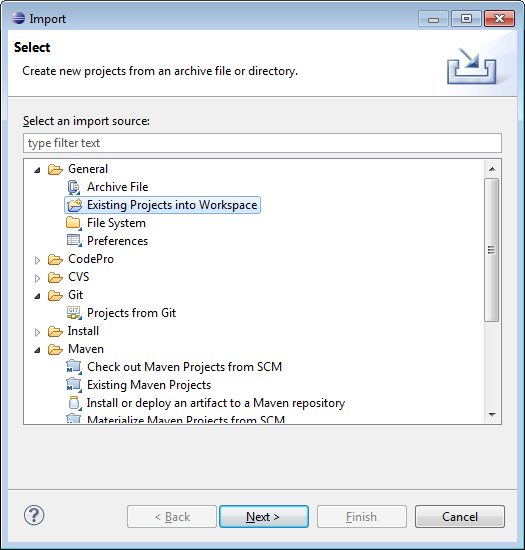
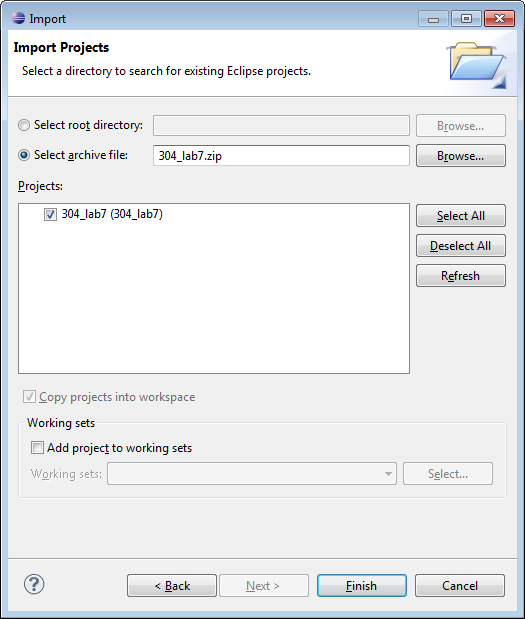

# COSC 304 - Introduction to Database Systems<br>Assignment 7 - Building a Database-enabled Web Site using JSP

This assignment practices web development using a commercial database system, [Microsoft SQL Server](https://people.ok.ubc.ca/rlawrenc/teaching/304/Notes/sqlserver.html)</a>. SQL Server supports most of the SQL standard including foreign keys and triggers.  **The assignment is done in your project groups of 4 people. If you are off campus, you must connect using VPN to access the database. [VPN Info](https://it.ubc.ca/services/email-voice-internet/myvpn/setup-documents). The server is myvpn.ok.ubc.ca.**</p>

The web store that we are going to build allows customers to enter their information, chose products by putting them into a shopping cart, and then place an order.

## Initial Steps

1. If you are developing on your own laptop, you must [setup your development environment](https://people.ok.ubc.ca/rlawrenc/teaching/304/Notes/JavaEE/setup.html).

2. Download the [starter project code files](304_lab7.zip) and import into Eclipse as a Dynamic Web Server project.




3. Create the tables and load the sample data into your SQL Server database.  The file `LoadData.java` will load the database using the `data/orderdb_sql.ddl` script.  Make sure to set your own database, user id, and password.

4. Test your web site on your local machine.

5. **Optional:** Upload your working site to the server when completed. Before uploading, create a directory called `Lab7` in your `public_html/tomcat` directory in your home
account on `cosc304.ok.ubc.ca`.  All files for this assignment will be in that directory. Use [FileZilla](https://people.ok.ubc.ca/rlawrenc/teaching/304/Notes/filezilla/filezilla.html) to perform the upload.


## Databases and Autonumber Fields

This database storing customers, orders, and products uses autonumber fields to assign a primary key value for orders.  An autonumber field is an integer field which is automatically assigned by the database.  The value of the counter starts at 1.  When a record is added, the value of the autonumber field for the new record is set to the counter and then the counter is incremented.  Thus, the values of the autonumber field for records are 1,2,3,...  Autonumber fields are useful as primary keys as they are guaranteed to be unique.  To create an autonumber field in a SQL Server create table statement use the `IDENTITY` keyword: 

```
CREATE TABLE dummy (
   A int NOT NULL IDENTITY,
   B VARCHAR(50),
   ....
   PRIMARY KEY (A)
);
```

## Question 1 (10 marks)

Modify the `listorder.jsp` so that it lists all orders currently in the database. You must list all orders and the products of those orders.

#### Details:

1. [Sample output](http://cosc304.ok.ubc.ca/rlawrenc/tomcat/Lab7/listorder.jsp)

2. If you upload your site to the server in the folder `public_html/tomcat/Lab7` then your URL will be:
`http://cosc304.ok.ubc.ca/(yourUnivId)/tomcat/Lab7/shop.html`.  <br>For example, my web site is at:
[http://cosc304.ok.ubc.ca/rlawrenc/tomcat/Lab7/shop.html](http://cosc304.ok.ubc.ca/rlawrenc/tomcat/Lab7/shop.html).

3. The main shop page is [http://cosc304.ok.ubc.ca/rlawrenc/tomcat/Lab7/shop.html](http://cosc304.ok.ubc.ca/rlawrenc/tomcat/Lab7/shop.html).  Feel free to change it to your shop name and style!

4. Your output does not have to look exactly like the sample (feel free to make it look better!).

5. A good way to get started with `listorder.jsp` is to copy some of the [sample JDBC code posted (JdbcQuery.jsp)](../code/JdbcQuery.jsp) and modify it for this particular query. **Note that the URL is now for Microsoft SQL Server not MySQL.**</li>


#### Marking Guide:

- **+2 marks** - for SQL Server connection information and making a successful connection
- **+1 mark** - for using try-catch syntax
- **+2 marks** - for displaying order summary information for each order in a table
- **+3 marks** - for displaying items in each order in a table
- **+1 mark** - for formatting currency values correctly (e.g. $91.70)
- **+1 mark** - for closing connection (either explicitly or as part of try-catch with resources syntax)

## Question 2 (30 marks)

Build a simple web site that allows users to search for products by name, put products in their shopping cart, and place an order by checking out the items in their shopping cart. Starter code is provided. Fill in a few of the JSP files to get the application to work.  Here are the steps you should do to get started:

1. Use the [template code](304_lab7.zip) downloaded and setup in Eclipse in Question 1. Summary of files:

- **listprod.jsp** - lists all products.  **TODO: fill-in your own code (10 marks)**
- **addcart.jsp** - adds an item to the cart (stored using session variable).  No changes needed.
- **showcart.jsp** - displays the items in the cart.  No changes needed.
- **checkout.jsp** - page to start the checkout.  No changes needed.
- **order.jsp** - store a checked-out order to database. **TODO: fill-in your own code (20 marks)**

2. Take a look at the sample web site which is available at [http://cosc304.ok.ubc.ca/rlawrenc/tomcat/Lab7/shop.html](http://cosc304.ok.ubc.ca/rlawrenc/tomcat/Lab7/shop.html).

3. Start by editing the JSP file called `listprod.jsp`.  This file is called from `shop.html` when the user begins to shop.  The file allows a customer to search for products by name.  If a customer enters "ab", then the query should be: `productName LIKE '%ab%'`.

4. Start off with just being able to list products by name.  Inside `listprod.jsp` is a form whose GET method calls `listprod.jsp` itself.  When a user submits the form, the URL passed to `listprod.jsp` will contain a parameter `productName`.  Based on this parameter, construct your query. Start with the template code and then add the required code to connect to the database and list the products.

5. The file `listprod.jsp` also allows users to add items to their cart. This is accomplished by having a link beside each item. When the user clicks on the link, another page called `addcart.jsp` is called with information on the product to add.

6. The file `addcart.jsp` expects the following parameters: `addcart.jsp?id=(productId)&name=(productName)&price=(productPrice)`.  You must make sure that you create the appropriate links when listing your products.

7. `addcart.jsp` calls another file that maintains a record of the shopping cart over a user's session.  This file is `showcart.jsp`.

8. `When the user wants to check-out, they must enter customer information.  The file `checkout.jsp` prompts the user for a customer id and passes that information onto the JSP file `order.jsp`.

9. The other file you must write is `order.jsp`. This file must save an order and all its products to the database as long as a valid customer id was entered.

10. Make sure to list the order id and all items as shown in the example.


#### Marking Guide (for listprod.jsp): (10 marks total)

- **+1 mark** - for SQL Server connection information and making a successful connection
- **+2 marks** - for using product name parameter to filter products shown (must handle case where nothing is provided in which case all products are shown)
- **+1 mark** - for using PreparedStatements
- **+2 marks** - for displaying table of products
- **+3 marks** - for building web link URL to allow products to be added to the cart
- **+1 mark** - for closing connection (either explicitly or as part of try-catch with resources syntax)

#### Marking Guide (for order.jsp): (20 marks total)

- **+1 mark** - for SQL Server connection information and making a successful connection
- **+3 marks** - for validating that the customer id is a number and the customer id exists in the database. Display an error if customer id is invalid.
- **+1 mark** - for showing error message if shopping cart is empty
- **+3 marks** - for inserting into ordersummary table and retrieving auto-generated id
- **+6 marks** - for traversing list of products and storing each ordered product in the orderproduct table
- **+2 marks** - for updating total amount for the order in OrderSummary table
- **+2 marks** - for displaying the order information including all ordered items
- **+1 mark** - for clearing the shopping cart (sessional variable) after order has been successfully placed
- **+1 mark** - for closing connection (either explicitly or as part of try-catch with resources syntax)


#### Bonus Marks<

Up to 10 bonus marks can be received by going beyond the basic assignment requirements:

- **+5 marks** - for allowing a user to remove items from their shopping cart and to change the quantity of items ordered when viewing their cart.
- **+5 marks** - for validating a customer's password when they try to place an order.
- **+5 marks** - your site runs on cosc304.ok.ubc.ca or another server not just on your local development machine
- **Up to +5 marks** - for improving the looks of the site such as:
	- **+2 marks** - for a page header with links to product page, list order, and shopping cart
	- **+3 marks** - for formatting product listing page to include better formatting as well as filter by category	
	- **+3 marks** - for improved formatting of cart page		

- Other bonus marks may be possible if discussed with the TA/instructor.

**If you want to be eligible for bonus marks, please note that on your assignment and explain what you did to deserve the extra marks.  An [example web site with improved features is available](http://cosc304.ok.ubc.ca/rlawrenc/tomcat/Lab7/bonus/shop.html).**

#### Deliverables:

1. Option #1: Demonstrate your working site to the TA and get +2 bonus marks. No submission on Canvas is required.
2. Option #2: Submit in a single zip file all your source code using Canvas. This can be done by exporting your project. Submit all your files, but the files you must change are: `listprod.jsp`, `listorder.jsp` and `order.jsp`.
3. You do NOT have to get the code uploaded and running on the web server cosc304.ok.ubc.ca to complete the assignment. However, if you do, you can submit the URL on the server for the TA to test your assignment.
4. Only one submission for all members fo the group. Put all partner's names and student numbers on the submission.
